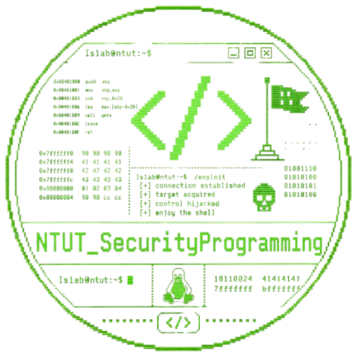

# NTUT_SP — 安全程式 / Pwn Lab

**臺北科技大學 (NTUT) 安全程式** 課程的 Lab 練習專案，主要學習**基礎 x86-64 Linux binary exploitation (Pwn)**：從組語語言,stack frame 開始，一路做到 buffer overflow,shellcode,format string,ret2libc,ROP

每一題都同時提供：
- `xxx.c`：題目原始碼
- `xxx_practice.c`：你自己練習用的版本（可以亂改）
- 編譯出來的 ELF 二進位（由 `Makefile` 統一產出）

並且每題的 **編譯 flag (canary / NX / PIE / RELRO)** 已經在 `pwn_lab/Makefile` 裡分好類，會直接決定該題要用什麼手法解

---

## 目錄結構

```
NTUT_SP/
└── pwn_lab/
    ├── Makefile                     # 一次編譯所有 lab，依題目套不同的保護機制
    ├── asm_lab/                     # 觀察組語 / 變數運算
    │   ├── asm_lab.c
    │   └── asm_lab                  # 已編譯
    ├── part0x1/lab/                 # 入門關卡
    │   ├── 1_hello_world/           # printf / main 流程
    │   ├── 2_stack/                 # 觀察 stack frame、local var
    │   ├── 3_bof_backdoor/          # 經典 BOF 跳 backdoor
    │   ├── 3.5_backdoor_plus/       # BOF + 多 buffer 排列
    │   ├── 4_bof_shellcode/         # BOF + 自寫 shellcode
    │   └── 5_format_string/         # format string 任意讀寫 + backdoor
    ├── part0x2/lab/                 # 進階變化
    │   ├── 1_canary/                # FSB leak canary -> BOF
    │   ├── 2_shellcode2/            # FSB leak stack addr -> shellcode
    │   ├── 3_fsb_got/               # 純 FSB，無 backdoor，改 GOT
    │   └── 4_ret2libc/              # PIE + Full RELRO + NX，必須 ret2libc
    └── rop/                         # NX + no-PIE，無 backdoor，純 ROP
```

---

## 各題保護機制總覽

`Makefile` 已經針對每題使用不同的 gcc flag，這裡列出對應關係，解題前先看這張表決定走哪條路：

| 題目 | Canary | NX (execstack) | PIE | RELRO | 預期手法 |
|---|---|---|---|---|---|
| [asm_lab](pwn_lab/asm_lab/) / [1_hello_world](pwn_lab/part0x1/lab/1_hello_world/) / [2_stack](pwn_lab/part0x1/lab/2_stack/) | (僅觀察用，不關心保護) | — | — | — | 看組語 |
| [3_bof_backdoor](pwn_lab/part0x1/lab/3_bof_backdoor/) | ❌ | ✅ 可執行 | ❌ no-PIE | norelro | BOF → `open_shell` |
| [3.5_backdoor_plus](pwn_lab/part0x1/lab/3.5_backdoor_plus/) | ❌ | ✅ 可執行 | ❌ no-PIE | norelro | BOF（注意 buffer 排列）|
| [4_bof_shellcode](pwn_lab/part0x1/lab/4_bof_shellcode/) | ❌ | ✅ 可執行 | ❌ no-PIE | norelro | BOF + shellcode 落在 stack |
| [5_format_string](pwn_lab/part0x1/lab/5_format_string/) | ✅ 保留 canary | ✅ 可執行 | ❌ no-PIE | norelro | FSB leak + 改 ret |
| [1_canary](pwn_lab/part0x2/lab/1_canary/) | ✅ stack-protector-all | ❌ noexecstack | ❌ no-PIE | norelro | FSB leak canary → BOF |
| [2_shellcode2](pwn_lab/part0x2/lab/2_shellcode2/) | ❌ | ✅ 可執行 | ❌ no-PIE | norelro | FSB leak stack → shellcode |
| [3_fsb_got](pwn_lab/part0x2/lab/3_fsb_got/) | ❌ | ❌ noexecstack | ❌ no-PIE | norelro | 純 FSB 改 GOT |
| [4_ret2libc](pwn_lab/part0x2/lab/4_ret2libc/) | ❌ | ❌ noexecstack | ✅ PIE | ✅ Full RELRO | leak libc → ret2libc |
| [rop](pwn_lab/rop/) | ❌ | ❌ noexecstack | ❌ no-PIE | norelro | 純 ROP（無 backdoor）|

> 提醒：保護機制是在 `pwn_lab/Makefile` 編譯期就決定的，重新編出來的檔案才會反映你的修改。

---

## 前置環境

請在 **Linux (x86-64)** 或 WSL 環境執行。建議：

- Ubuntu 22.04 / 24.04 (或 WSL2 Ubuntu)
- `gcc`、`make`、`gdb`
- `pwntools` (Python 3)：`pip install pwntools`
- `pwndbg` 或 `gef` 或 `peda`（gdb 外掛，看 stack/暫存器更直覺）
- `checksec`（驗證保護機制）
- `ROPgadget` 或 `ropper`（找 gadget）

可選：`one_gadget`、`ltrace`、`strace`。

---

## 如何使用

### 1. 一次編譯全部 lab

```bash
cd pwn_lab
make            # 編出所有 LABS 列表中的執行檔
make clean      # 清掉所有編出的 ELF
make check      # 對每個 ELF 跑 checksec，驗證保護機制是否如預期
```

### 2. 只編單一題

`Makefile` 的目標就是 ELF 路徑本身，例如：

```bash
cd pwn_lab
make part0x1/lab/3_bof_backdoor/backdoor
make part0x1/lab/3_bof_backdoor/backdoor_practice
make part0x2/lab/4_ret2libc/ret2libc
```

### 3. 練習用流程

每題都有兩份原始碼：

- `xxx.c`：**勿改**，當作參考解 / demo
- `xxx_practice.c`：你自己改的版本，例如試著加大 buffer、把保護打開看看會怎樣、或寫自己的 exploit

修改 `_practice.c` 後重新 `make` 對應 target 即可

### 4. 執行 / 解題

```bash
# 直接執行
./part0x1/lab/3_bof_backdoor/backdoor

# 用 gdb 看
gdb ./part0x1/lab/3_bof_backdoor/backdoor

# 驗證保護
checksec --file=./part0x2/lab/4_ret2libc/ret2libc

# 用 pwntools 寫 exploit（建議放在各題資料夾下取名 exp.py）
python3 exp.py
```

---

## 常用指令小抄

```bash
# 看保護
checksec --file=./binary

# 找字串、看符號
strings ./binary | grep -i sh
nm ./binary | grep -E "open_shell|gift|system"
objdump -d -M intel ./binary | less

# 找 ROP gadget
ROPgadget --binary ./binary | grep ": pop rdi"
ropper -f ./binary --search "pop rdi"

# pwntools 模板
python3 - <<'PY'
from pwn import *
context.binary = './binary'
p = process('./binary')
# p = remote('host', port)
p.interactive()
PY
```
